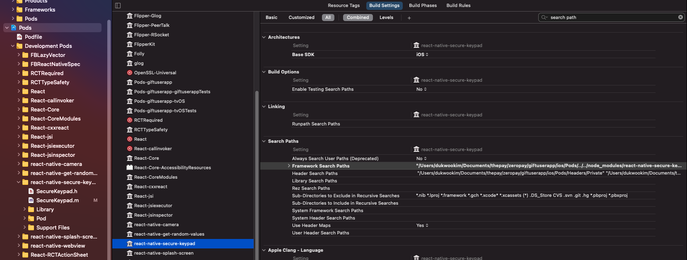
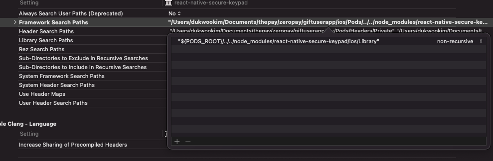

# react-native-secure-keypad

secure keypad for react-native

## Installation

```sh
yarn add https://github.com/The9-Kim/react-native-secure-keypad
```

```sh
cd ios
pod install
```

pod install 후 Xcode로 프로젝트를 열어 Pods > react-native-secure-keypad > Build Settings > Framework SearchPaths 에 아래 내용을 추가한다

```
"${PODS_ROOT}/../../node_modules/react-native-secure-keypad/ios/Library"
```





## Usage

```js
import SecureKeypad from "react-native-secure-keypad";

// ...
const inNeedNewHash = true; // or false
const result = await SecureKeypad.show(PATH.키패드해시요청, 6, '거래 승인번호 입력', isNeedNewHash);
```

## Contributing

See the [contributing guide](CONTRIBUTING.md) to learn how to contribute to the repository and the development workflow.

## License

MIT
